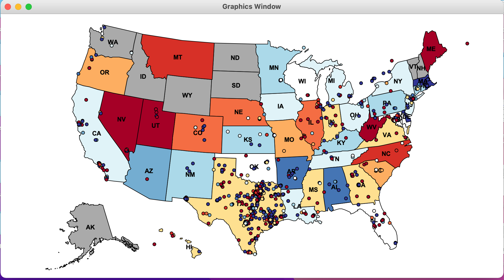

## Project description

The purpose of this project this is to develop a geographic visualization of Twitter data across the USA.
Dictionaries, lists, and data abstraction techniques were used to create a modular program.

The map displayed above depicts how the people in different states feel about Texas. This image is generated by:

1. Collecting public Twitter posts (tweets) that have been tagged with geographic locations and filtering for those that contain the "texas" query term,
2. Assigning a sentiment (positive or negative) to each tweet, based on all of the words it contains,
3. Aggregating tweets by the state with the closest geographic center, and finally
4. Coloring each state according to the aggregate sentiment of its tweets. Red means positive sentiment; blue means negative.